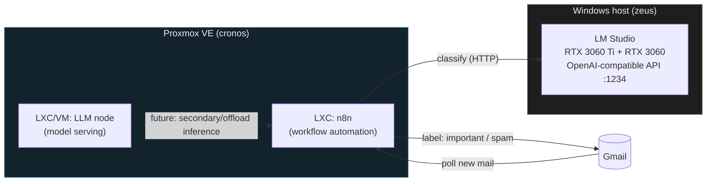

# email_spam_llm — Self-Hosted AI Homelab

A small homelab that pairs **local LLM inference** with **workflow automation**
to triage a real inbox (important vs. spam vs. normal) without any email
content ever leaving the network. Built as a portfolio piece: Infrastructure
as Code on Proxmox, a local model serving layer, and an n8n pipeline tying
it together.

## Why this exists

Cloud LLM APIs are fine, but routing personal email through a third party
just to sort it isn't necessary — a 3–14B local model on consumer GPUs is
plenty for triage-quality classification. This repo is the infra + pipeline
that proves it out, provisioned reproducibly instead of clicked together by
hand.

## Architecture



**Today:** inference runs on the Windows host (`zeus`) in LM Studio, using
the two GPUs directly — that's where the tokens/sec tuning lives (see
`docs/architecture.md`). Proxmox hosts the automation layer (n8n) and is
provisioned entirely through Terraform.

**Planned:** an in-cluster LLM node (`terraform/modules/lxc-llm`) so the
whole pipeline can run without depending on the Windows box — see the module
README for the tradeoffs.

## Stack

| Layer | Tool |
|---|---|
| Infra provisioning | Terraform (`bpg/proxmox` provider) |
| Hypervisor | Proxmox VE |
| Workflow automation | n8n |
| LLM serving | LM Studio (OpenAI-compatible API) |
| Model | Llama 3.2 3B / Qwen3 14B / Gemma 4 (local GGUF) |

## Repo layout

```
email_spam_llm/
├── terraform/              # IaC for the Proxmox guests
│   ├── main.tf
│   ├── variables.tf
│   ├── outputs.tf
│   ├── versions.tf
│   ├── terraform.tfvars.example
│   └── modules/
│       ├── lxc-n8n/         # n8n container
│       └── lxc-llm/         # future in-cluster inference node
├── n8n/
│   └── workflows/           # exported n8n workflow JSON (versioned pipeline)
├── docs/
│   ├── architecture.md      # design notes, GPU tuning writeup, decisions
│   └── setup.md             # from-zero setup instructions
└── scripts/                 # helper scripts (plan/apply wrappers, etc.)
```

## Getting started

```bash
cd terraform
cp terraform.tfvars.example terraform.tfvars   # fill in your Proxmox details
terraform init
terraform plan
terraform apply
```

See [docs/setup.md](docs/setup.md) for the full walkthrough and
[docs/architecture.md](docs/architecture.md) for design decisions.

## Status

🚧 Early scaffold — infra structure and pipeline design are in place;
guests have not been applied yet.

## License

MIT — see [LICENSE](LICENSE).
