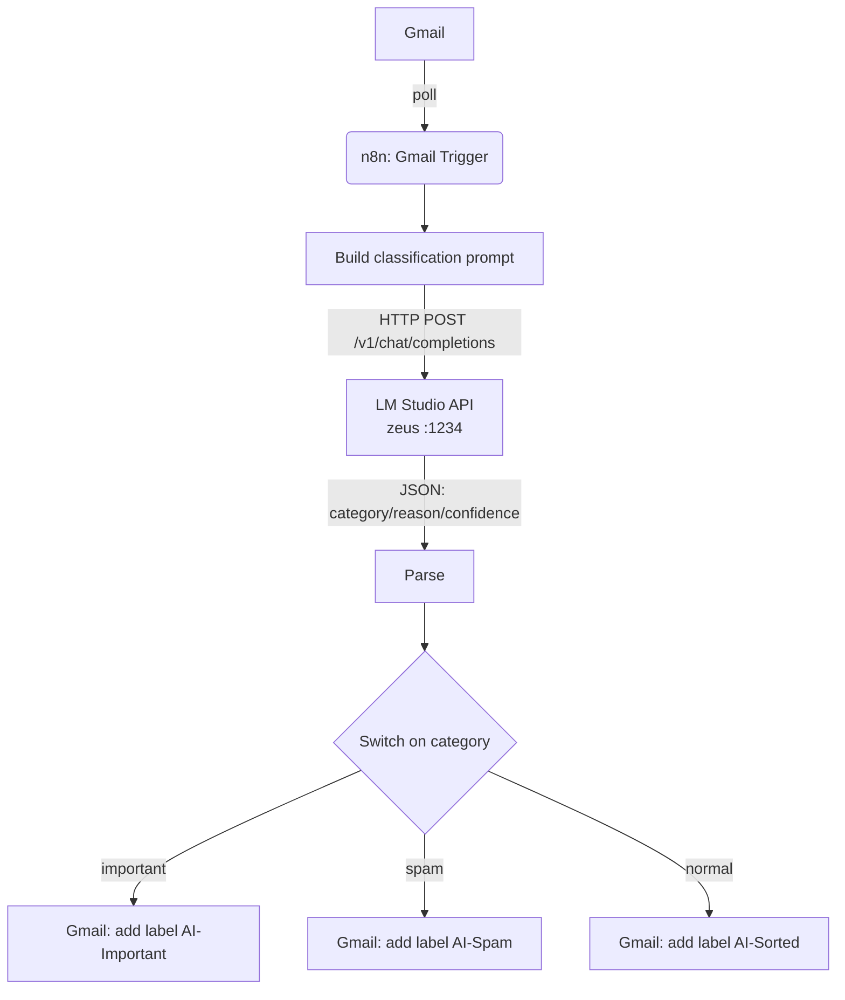

# Architecture & design decisions

## Overview

Two machines, one pipeline:

- **`zeus`** (Windows 11, dual GPU: RTX 3060 Ti 8GB + RTX 3060 12GB) — runs
  LM Studio, serving an OpenAI-compatible API on `:1234`, LAN-reachable at
  `http://10.10.10.202:1234/v1`.
- **`cronos`** (Proxmox VE 9.2.4) — hosts the automation layer. Provisioned
  by the Terraform in this repo.



## Why inference runs on the Windows host, not in Proxmox

The GPUs live in `zeus`, not `cronos`. Moving inference into a Proxmox guest
would mean GPU passthrough — full PCIe passthrough of one card (losing it
for the host) or vGPU (needs a license on consumer Ampere, unsupported).
Running LM Studio directly on `zeus` gets full, un-mediated access to both
cards for a fraction of the complexity. The `lxc-llm` module exists as a
placeholder for a future CPU-only or single-dedicated-GPU inference node,
off by default (`enable_llm_node = false`).

## GPU tuning summary (the part worth putting on a resume)

Baseline → tuned, on the 3B classifier model:

| Change | tok/s | Why |
|---|---|---|
| Default LM Studio load (`parallel: 4`, GPU auto-split, ctx 10865) | ~70 | baseline |
| `parallel: 1` + context 4096 | ~100 | parallel=4 over-allocates KV cache and fragments compute for a single-stream workload |
| Pin entirely to the RTX 3060 Ti (448 GB/s vs 360 GB/s on the 3060, and idle vs. the 3060 driving the desktop) | ~158 | token generation is memory-bandwidth-bound; cross-GPU split pays a PCIe sync cost every token |
| Undervolt core (frees the 225W power cap) + memory OC (+1200 MHz) | ~167 | card was power-limited, sagging below rated clocks; trading core headroom for memory bandwidth is a net win for a bandwidth-bound workload |
| Lighter quant (Q4_K_S → IQ4_XS, imatrix) | ~180 | fewer bytes read per token, same effective quality at 3B |

**~2.6× improvement, same hardware, zero dollars spent.**

For a model too large to fit the fast GPU alone (`gemma-4-12b-qat`, 7.15GB):
splitting evenly across both GPUs gave ~35 tok/s; forcing a **priority-order
split** (fill the fast GPU first, only overflow onto the second) gave
**~57 tok/s** — the split strategy matters as much as raw hardware.

Speculative decoding (small draft model verified by the target model) was
tested and **rejected** for this setup — on a single GPU with no compute
overlap between draft and target, it added latency instead of removing it,
because the target model was already fast enough that draft overhead
dominated.

## LLM classifier

- Model: `llama-3.2-3b-instruct-uncensored-i1` (Llama 3.2 3B, IQ4_XS
  imatrix quant) — fast enough that a per-email classification costs well
  under a second, small enough to keep resident alongside everything else
  on the Ti.
- `temperature: 0`, JSON-schema-constrained `response_format` for reliable
  parsing without a separate output parser.
- Larger models (`qwen/qwen3-14b`, `google/gemma-4-12b-qat`) are available
  on the same box for tasks that need more reasoning than triage does.

## Networking

- LM Studio's server binds `0.0.0.0:1234` — reachable from any device on
  `10.10.10.0/24`, no Tailscale required for LAN clients. Needed an
  explicit inbound firewall rule on `zeus` (Windows Firewall defaults to
  blocking unsolicited inbound on the Private profile without one):
  ```powershell
  New-NetFirewallRule -DisplayName "LM Studio LAN" -Direction Inbound -Action Allow -Protocol TCP -LocalPort 1234 -Profile Private,Domain
  ```
- `zeus`'s LAN IP (`10.10.10.202`) should be a DHCP reservation on the
  router, not a floating lease — the pipeline depends on it being stable.

## n8n over HTTPS, and the Gmail OAuth wrinkle

n8n serves plain HTTP by default. Getting a Gmail OAuth2 credential working
needed two fixes, both driven by constraints Google puts on OAuth redirect
URIs, not by n8n itself:

1. **Google requires the redirect URI scheme to be `https://`** (with one
   exception below). Fixed by having the `lxc-n8n` Terraform module
   generate a self-signed cert at bootstrap time (SAN'd to the container's
   real DHCP-assigned IP) and setting `N8N_PROTOCOL=https` /
   `N8N_SSL_KEY` / `N8N_SSL_CERT` in the compose file. Browsers flag the
   self-signed cert as "not secure," which is expected and harmless —
   Google only validates the URL *scheme*, not certificate trust, since
   the actual OAuth redirect is a browser navigation, not a server-to-
   server call.
2. **Google also rejects bare IP addresses as redirect URI hosts** —
   the host must end in a valid public TLD, or be `localhost`. A LAN IP
   like `10.10.10.109` satisfies neither. Worked around by registering
   `https://localhost:5678/rest/oauth2-credential/callback` as the
   redirect URI and doing the one-time "Connect my account" click through
   an SSH local port-forward (`ssh -L 5678:<n8n-ip>:5678 root@cronos`)
   so the browser sees it as `localhost`. The resulting OAuth token is
   stored in n8n regardless of which URL you access it from afterward —
   the tunnel is only needed for that single authorization step. A real
   owned domain (pointed at the LAN IP via a hosts-file entry, since
   Google doesn't verify DNS resolution at registration time) would avoid
   the tunnel permanently, at the cost of owning a domain.

Practical gotcha hit during setup: an unelevated PowerShell can't create
firewall rules (`Access is denied`) — needs "Run as administrator."

## Status

The full pipeline (Gmail Trigger → prompt → LM Studio classification →
parse → Switch → Gmail label) has been built and manually tested
end-to-end against real inbox mail on the test LXC. Not yet: exported
workflow JSON committed to the repo, and the workflow's `Active` toggle
flipped on for unattended polling.
